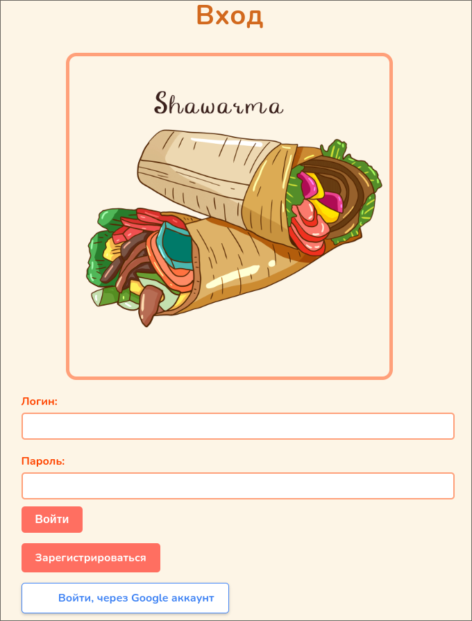

# shawarma-project
 Education Java Spring application for ordering shawarma
### Technologies used
- Spring boot
- Spring MVC
- Spring Data JPA
- Spring Security + OAuth2 full
- Thymeleaf
### Using gradlew
1. Install jdk 21
2. Generate your own Google Cloud Oauth2 clientID and clientSecret keys and add them to application.yml for working Google Authorization
3. Execute
```shell
./gradlew bootRun
```
4. Open http://localhost:8080

# Preview




